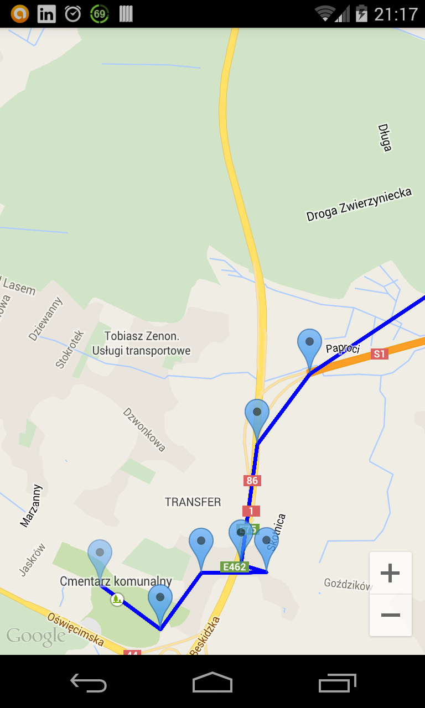

RouteDrawer
===========

RouteDrawer wraps Google Directions API (https://developers.google.com/maps/documentation/directions/) using RxJava for Android so developers can download, parse and draw path on the map in very fast and flexible way (For now only JSON support).

[](https://www.apache.org/licenses/LICENSE-2.0) [](https://android-arsenal.com/details/1/1106)

The library contains two main parts.

 - RouteApi
    is responsible for sending request to Google's Direction API and handling the response

 - DrawerApi
    is responsible for drawing the path on the map



GRADLE
===========
If you are using gradle you have to add this one line of code to your build.gradle file under dependencies section:

```xml
    compile 'com.github.polok.routedrawer:library:1.0.0'
```

In other case you have to take whole library project.

USAGE
===========
First we have to download the path. For this we need to provide two points (start and end) and travel mode.


```java
public interface RouteApi {
    Observable<String> getJsonDirections(final LatLng start, final LatLng end, final TravelMode mode);
}
```

Where travel mode can be:

```java
public enum TravelMode {
    DRIVING,
    WALKING,
    BICYCLING,
    TRANSIT
}
```

As you can see the above method returns Observable and our response is a String.
So far so good, we downloaded the route but what the hell - response as String, I don't want to parse it on my own.

With RxJava and some transformations nothing more easily.

Have a look:

```java
routeRest.getJsonDirections(new LatLng(50.126922, 19.015261), new LatLng(50.200206, 19.175603), TravelMode.DRIVING)
                .observeOn(AndroidSchedulers.mainThread())
                .map(new Func1<String, Routes>() {
                    @Override
                    public Routes call(String s) {
                        return new RouteJsonParser<Routes>().parse(s, Routes.class);
                    }
                })
                .subscribe(new Action1<Routes>() {
                    @Override
                    public void call(Routes r) {
                        ...
                    }
                });
```

The most important part here is

```java
...
.map(new Func1<String, Routes>() {
                    @Override
                    public Routes call(String s) {
                        return new RouteJsonParser<Routes>().parse(s, Routes.class);
                    }
                })
```

For more details about 'map' operator can be find here - https://github.com/ReactiveX/RxJava/wiki/Transforming-Observables#map
In short, we parse our response to Routes object, so now we can go to draw the path on the map.


Here we have to use DrawerApi which for now provides one method:
```java
void drawPath(Routes routes);
```
(for now it forces to use Routes object).

We are almost there but before we invoke draw method we have to build our drawer using RouteDrawerBuilder.
It allows us to customize a little bit the path and the markers. It requires to get GoogleMap(!) and if we want we can provide
```
- marker icon
- path width
- path color
- marker alpha
```

This can look as

```java
    final RouteDrawer routeDrawer = new RouteDrawer.RouteDrawerBuilder(googleMap)
                .withColor(Color.BLUE)
                .withWidth(8)
                .withAlpha(0.5f)
                .withMarkerIcon(BitmapDescriptorFactory.defaultMarker(BitmapDescriptorFactory.HUE_ORANGE))
                .build();
```


And taking all together:

```java
    private GoogleMap googleMap;

    @Override
    protected void onCreate(Bundle savedInstanceState) {
        super.onCreate(savedInstanceState);

        setContentView(R.layout.activity_main);

        googleMap = ((MapFragment) getFragmentManager().findFragmentById(R.id.map)).getMap();

        final RouteDrawer routeDrawer = new RouteDrawer.RouteDrawerBuilder(googleMap)
                .withColor(Color.BLUE)
                .withWidth(8)
                .withAlpha(0.5f)
                .withMarkerIcon(BitmapDescriptorFactory.defaultMarker(BitmapDescriptorFactory.HUE_ORANGE))
                .build();

        RouteRest routeRest = new RouteRest();

        routeRest.getJsonDirections(new LatLng(50.126922, 19.015261), new LatLng(50.200206, 19.175603), TravelMode.DRIVING)
                .observeOn(AndroidSchedulers.mainThread())
                .map(new Func1<String, Routes>() {
                    @Override
                    public Routes call(String s) {
                        return new RouteJsonParser<Routes>().parse(s, Routes.class);
                    }
                })
                .subscribe(new Action1<Routes>() {
                    @Override
                    public void call(Routes r) {
                        routeDrawer.drawPath(r);
                    }
                });

    }
```

Developed By
------------
Marcin Polak - mpolak87(at).gmail.com

License
----------

```
Copyright 2015 Marcin Polak

Licensed under the Apache License, Version 2.0 (the "License");
you may not use this file except in compliance with the License.
You may obtain a copy of the License at

http://www.apache.org/licenses/LICENSE-2.0

Unless required by applicable law or agreed to in writing, software
distributed under the License is distributed on an "AS IS" BASIS,
WITHOUT WARRANTIES OR CONDITIONS OF ANY KIND, either express or implied.
See the License for the specific language governing permissions and
limitations under the License.
```


